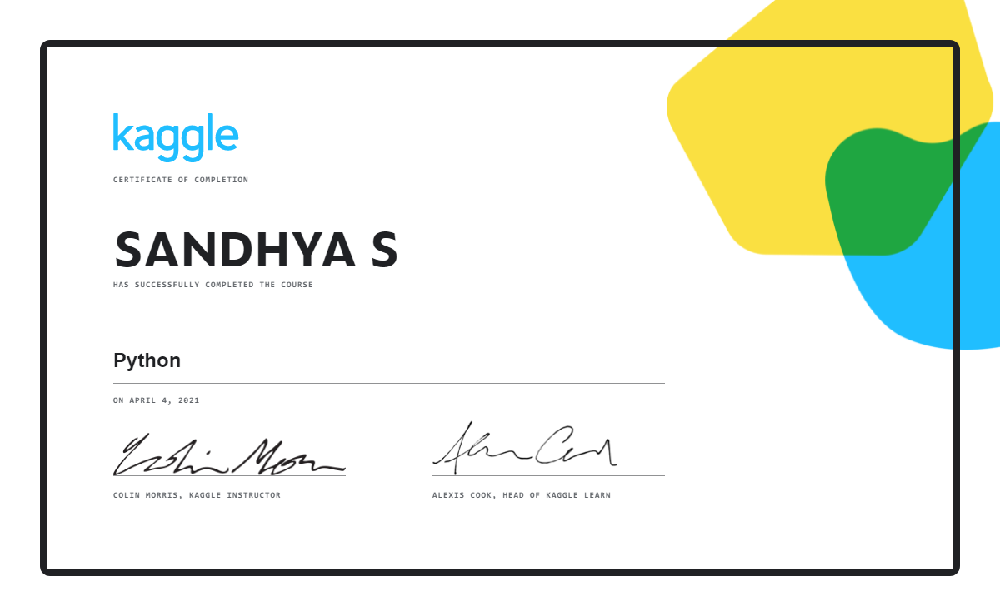
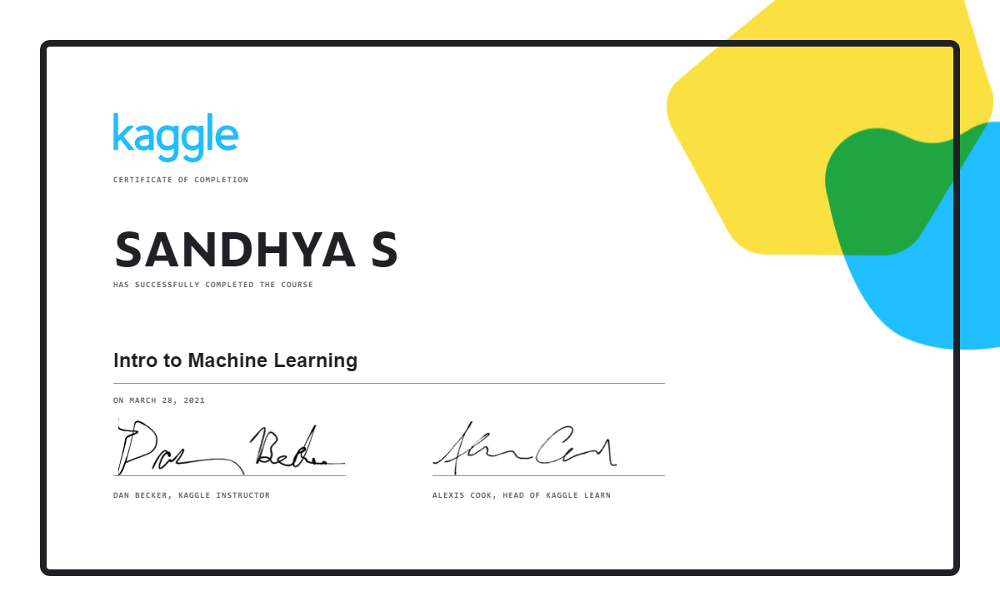
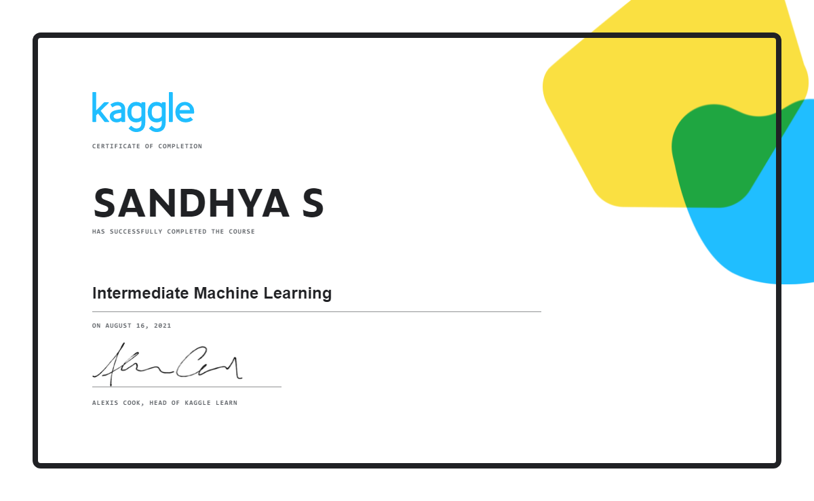

# 📋 _30 Days of ML with Kaggle_
### _Machine learning beginner → Kaggle competitor in 30 days: Aug '21_
### _Organizer: ALEXIS COOK, Kaggle Learn_
---
## _Overview_
#### * _In the first 2 weeks, you’ll receive hands-on assignments delivered to your inbox. The goal of these assignments is to rapidly cover the most essential skills needed to get your hands dirty with data. You'll start by learning how to code in Python and quickly learn how to build your first machine learning model._
#### * _After tackling these core concepts, you’ll be invited to a super fun, beginner-friendly Kaggle machine learning competition to test your knowledge. Through practice, you’ll explore the best ways to use Kaggle as a learning resource and connect with other data scientists._
#### * _On top of all of this, you’ll have the opportunity to attend elective workshops and seminars hosted by data scientists from Google's Developer Experts Program. The challenge kicks off on August 2nd and only requires a Kaggle account._
---
## _Program Highlights_
#### 📚 _2 weeks of daily, hands-on assignments (with emails to keep you on track)_
#### 📃 _Course completion certificates_	  
#### 💬 _Learning community chat room access_  
#### 🎥 _Elective workshops by Google's Developer Expert Data Science Program_	  
#### ⛰️ _Invitation to a beginner-friendly, invite-only Kaggle competition_	  
#### 🏆 _Competition prizes (Kaggle Swag for top 10 teams on leaderboard)_  
---
## _Daily Activities_
|        | _Course_ | _Day_ | _Activity_ | 
| ------ | :----------: | :--- |  :--- |
| **_Week 1_** || _01_ | [_Level up to Contributor_](Activities/Day%20%2301) | 
|| **_Python_** | _02_ | _Lesson 1: [Hello, Python](Activities/Day%20%2302)_ |
||| _03_ |_Lesson 2: [Functions and Getting Help](Activities/Day%20%2303)_ |
||| _04_ | _Lesson 3: [Booleans and Conditionals](Activities/Day%20%2304)_ |
||| _05_     | _Lesson 4: [Lists](Activities/Day%20%2305)   Lesson 5: [Loops and List Comprehensions](Activities/Day%20%2305)_ |
||| _06_ | _Lesson 6: [Strings and Dictionaries](Activities/Day%20%2306)_ |
||| _07_ | _Lesson 7: [Working with External Libraries](Activities/Day%20%2307)_ |
| **_Week 2_**     | **_Intro to ML_**     | _08_     | _Lesson 1: [How Models Work](Activities/Day%20%2308)   Lesson 2: [Basic Data Exploration](Activities/Day%20%2308)_ | 
||| _09_     | _Lesson 3: [Your First Machine Learning Model](Activities/Day%20%2309)   Lesson 4: [Model Validation](Activities/Day%20%2309)_ | 
||| _10_     | _Lesson 5: [Underfitting and Overfitting](Activities/Day%20%2310)   Lesson 6: [Random Forests](Activities/Day%20%2310)_ | 
||| _11_ | _Lesson 7: [Machine Learning Competitions](Activities/Day%20%2311)_ |
|| **_Intermediate ML_**      | _12_       | _Lesson 1: [Introduction](Activities/Day%20%2312)   Lesson 2: [Missing Values](Activities/Day%20%2312)   Lesson 3: [Categorical Values](Activities/Day%20%2312)_|
||| _13_     | _Lesson 4: [Pipelines](Activities/Day%20%2313)   Lesson 5: [Cross-Validation](Activities/Day%20%2313)_ | 
||| _14_     | _Lesson 6: [XGBoost](Activities/Day%20%2314)   Lesson 7: [Data Leakage](Activities/Day%20%2314)_ | 
| **_Week 3_** | **___** | _15 - 21_ | _[Get started with the competition](Activities/Day%20%2315)_ | 
| **_Week 4_** | **___** | _22 - 29_ | _[Extracurricular Workshops](Activities/Day%20%2322)_ | 
||| _30_ | _[End of the Program](Activities/Day%20%2330)_ |
---
## _Achievements_
_Python_ | _Intro to ML_ |  _Intermediate ML_ |
:---------------:| :------------:| :------------:|
 |  |  |

---
